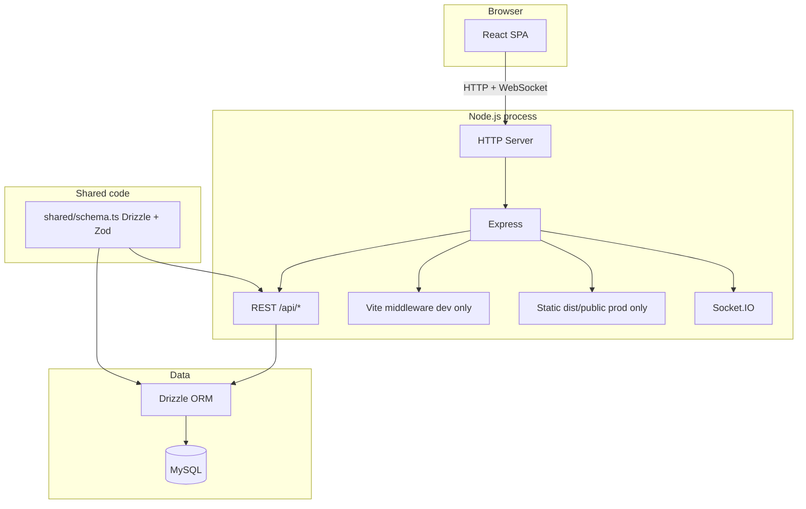

# Pulse (chatsystem) — architecture

## Logical view

## Session and auth

Express uses **`express-session`** with an in-memory store (`memorystore`) so `req.session.userId` works for `/api/auth/*` and protected routes. Set a strong **`SESSION_SECRET`** in production.

## Modes

| Command | UI | API / DB / sessions |
|---------|-----|----------------------|
| `npm run dev` | Vite (middleware) | Same process |
| `npm run dev:client` | Vite only | Not started |
| `npm run build` + `npm start` | `dist/public` static | Express + bundled server |

## Build

`script/build.ts` runs Vite for the client, then esbuild for `server/index.ts` → `dist/index.cjs`.
